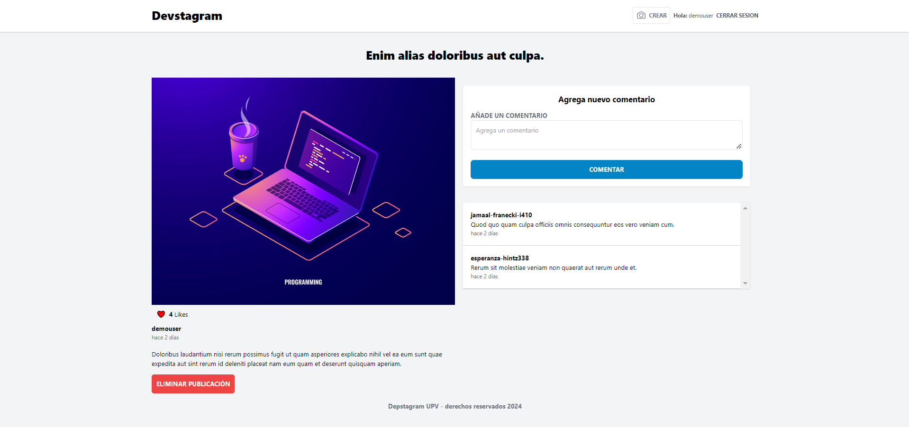

# Devstagram

Este proyecto fue desarrollado como parte de la asignatura **"Tecnologías y aplicaciones en internet"**. El objetivo del proyecto fue aprender los fundamentos del framework Laravel. El objetivo del proyecto era aprender los fundamentos del framework Laravel. El proyecto se inició en clase, pero quedó incompleto, ya que, con los conocimientos adquiridos durante su desarrollo, se nos solicitó otro proyecto como entrega final de la asignatura (puedes verlo [aquí](https://github.com/urieltorres-dev/sistema-de-administracion-de-proyectos).). Tiempo después decidí terminar el proyecto por mi cuenta para continuar aprendiendo y mejorar mis habilidades en Laravel.

## Descripción del Proyecto

**Devstagram** es una red social para desarrolladores, inspirada en redes sociales actuales como Instagram o X, donde los usuarios pueden compartir imágenes, comentar y dar "me gusta" a las publicaciones de otros desarrolladores. La aplicación está desarrollada en **Laravel** y permite la creación de perfiles, la publicación de imágenes, la interacción a través de comentarios y el seguimiento de otros usuarios.

## Características

- Registro y autenticación de usuarios.
- Publicación de imágenes con descripción.
- Sistema de comentarios en las publicaciones.
- "Me gusta" en las publicaciones.
- Seguimiento entre usuarios.
- Perfil de usuario con imagen personalizada.
- Interfaz amigable y responsive.

## Tecnologías Utilizadas

+ **Lenguajes de Programación:** PHP, HTML, CSS y JavaScript
+ **Base de Datos:** MySQL
+ **Frameworks:** Laravel y Tailwind CSS
+ **Herramientas de Desarrollo:** Docker, Visual Studio Code

## Instalación y Configuración

Para ejecutar este proyecto en tu entorno local, sigue estos pasos:

1. **Clona el Repositorio:**
```bash
git clone https://github.com/urieltorres-dev/devstagram.git
```

2. **Instala las dependencias de PHP y JavaScript:**
```bash
composer install
npm install
npm run dev
```

3. **Configura el Entorno:**
+ Asegúrate de tener PHP y MySQL instalados.
+ Configura los parámetros de la base de datos en el archivo `.env`.
+ Ejecuta las migraciones y seeders para crear las tablas y cargar datos de prueba:
```bash
php artisan migrate --seed
```

4. **Ejecuta el Proyecto:**
+ Inicia el servidor de desarrollo de Laravel:
```bash
php artisan serve
```
+ Accede a la aplicación a través de tu navegador en `http://localhost:8000`.

## Capturas de Pantalla

A continuación se muestran algunas capturas de pantalla de la aplicación:





## Demo

Por el momento la demo no está  disponible.

## Licencia

Este proyecto está licenciado bajo la Licencia MIT - consulta el archivo [LICENSE](https://choosealicense.com/licenses/mit/) para más detalles.

## Contacto

Para más información o consultas, puedes contactarme a través de [urieltorres.dev@gmail.com](mailto:urieltorres.dev@gmail.com) o en [github.com/urieltorres-dev](https://github.com/urieltorres-dev).

